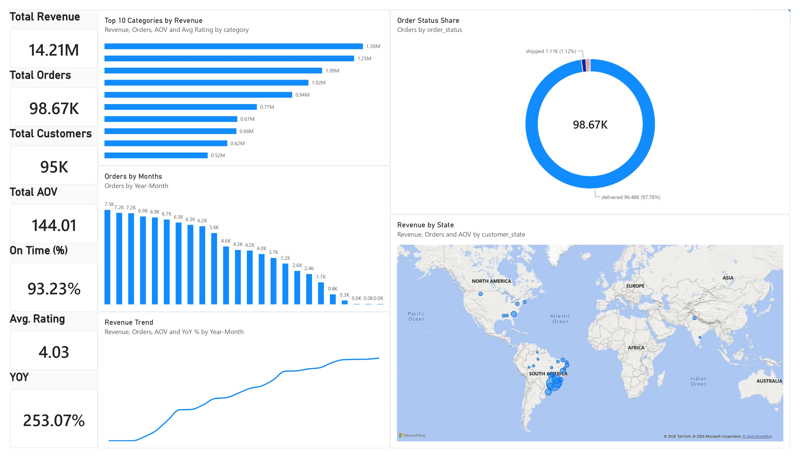
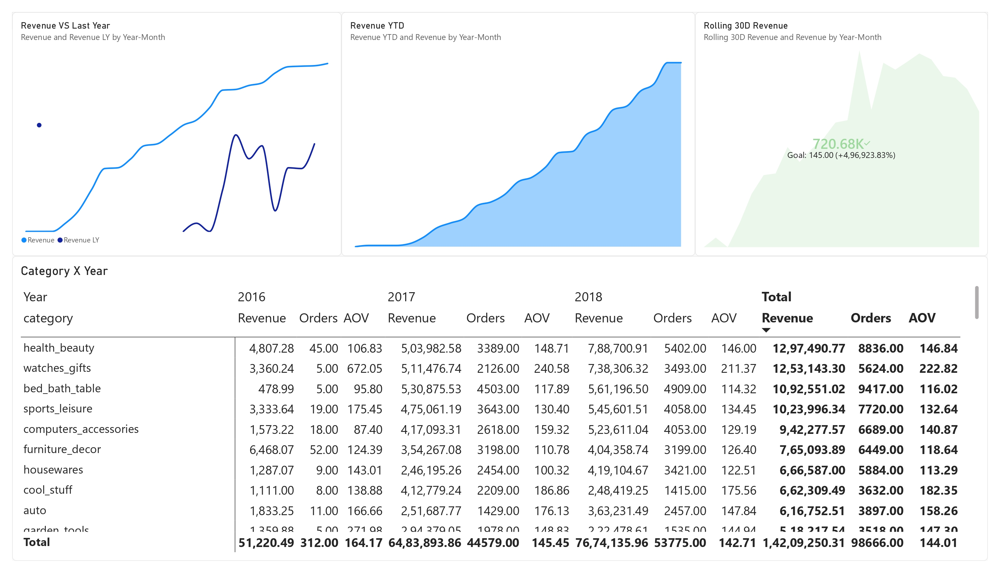
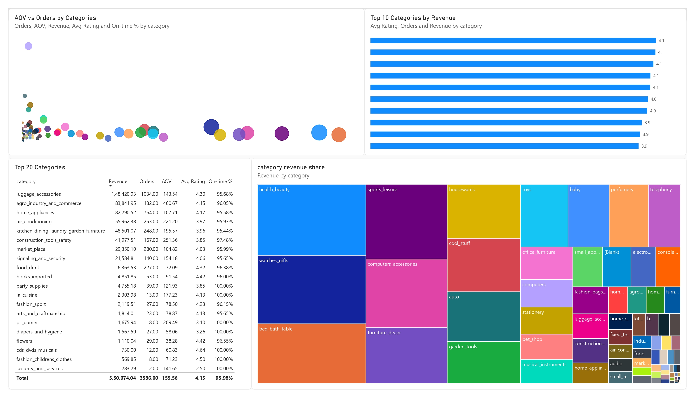
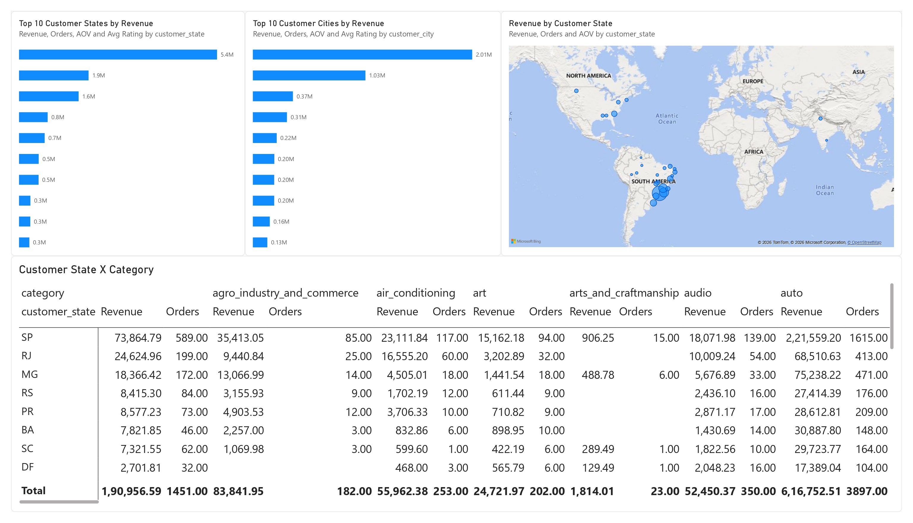
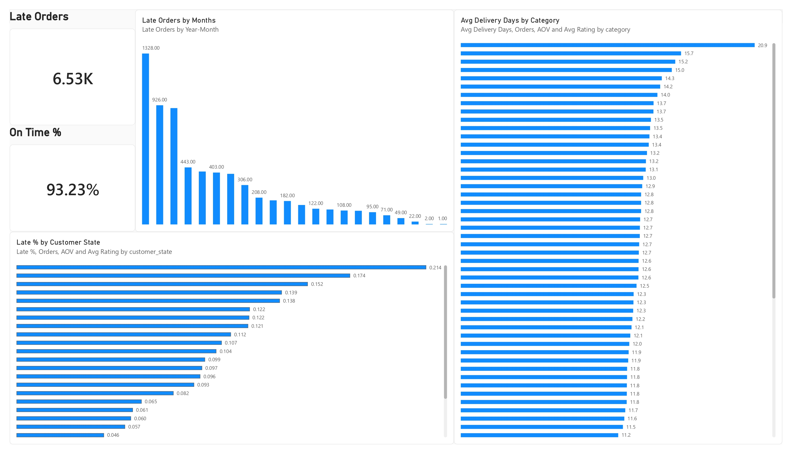
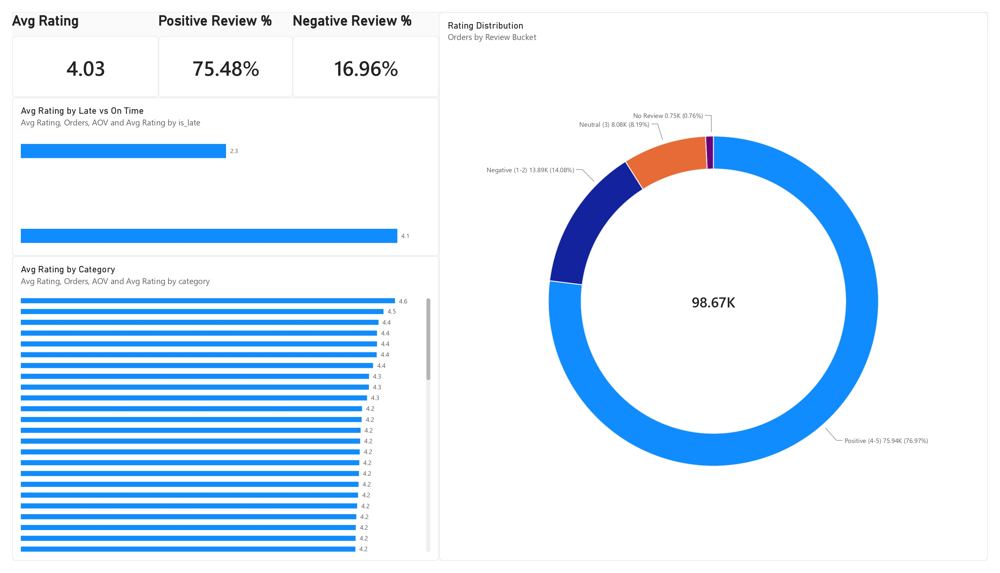
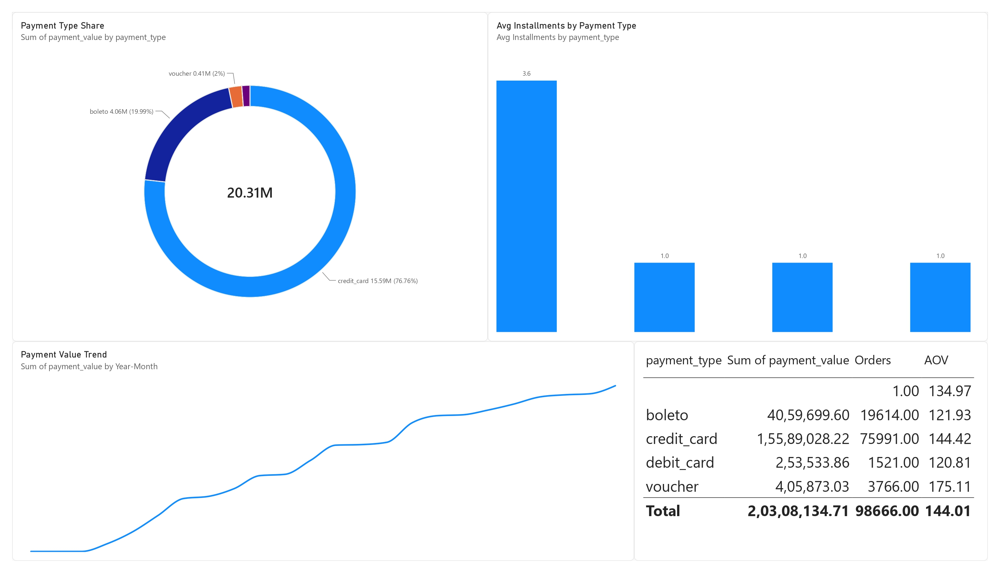
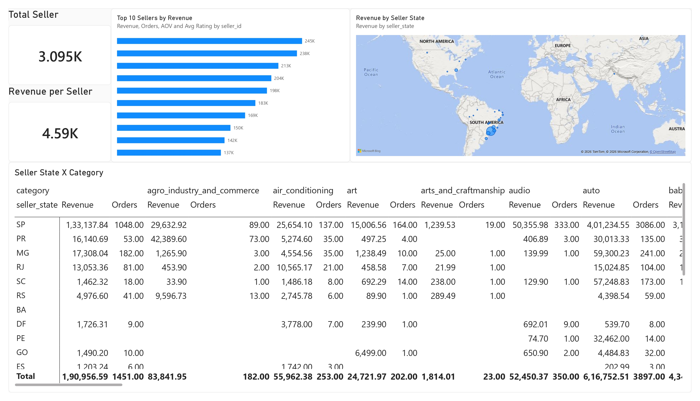
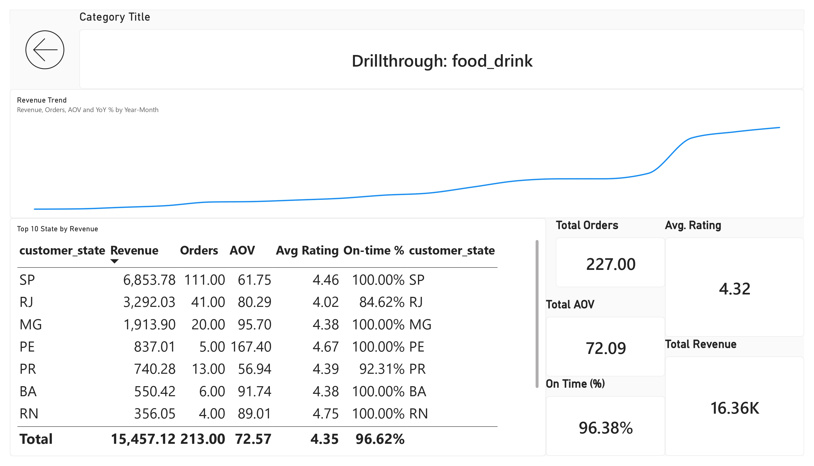

# 🛒 Olist E-commerce Analytics Dashboard

> An end-to-end e-commerce analytics project built using **Power BI, DAX, Excel, and data analysis** on the Brazilian Olist e-commerce dataset.

---

## 📌 Project Overview

This project focuses on analyzing e-commerce business performance using transactional data from the **Olist Brazilian E-commerce dataset**.

I transformed raw e-commerce data into an interactive **Power BI dashboard** covering sales, customers, products, categories, delivery performance, reviews, payments, sellers, and geographic analysis.

The dashboard is designed to provide both **high-level business KPIs** and **detailed drill-down analysis**.

---

## 🎯 Project Objectives

- Analyze overall sales and revenue performance
- Identify high-performing product categories
- Understand customer and geographic distribution
- Analyze delivery and logistics performance
- Evaluate customer reviews and satisfaction
- Understand payment behavior
- Compare seller performance
- Track business performance over time
- Provide interactive category-level drillthrough analysis

---

## 🛠️ Tools & Technologies

| Tool / Technology | Purpose |
|---|---|
| **Power BI** | Dashboard development & visualization |
| **DAX** | KPI calculations & analytical measures |
| **Excel** | Data dictionary & supporting analysis |
| **CSV** | Raw dataset files |
| **Data Modeling** | Connecting multiple e-commerce datasets |
| **Data Visualization** | Business insights & reporting |

---

# 📊 Dashboard

The Power BI dashboard contains **9 analytical pages**.

### 1️⃣ Executive Overview

Provides a high-level summary of business performance through:

- Total Revenue
- Total Orders
- Total Customers
- Average Order Value
- On-Time Delivery %
- Average Rating
- YoY Revenue Growth
- Revenue trends
- Monthly order trends
- Top categories
- State-wise revenue
- Order status distribution

### 2️⃣ Sales Trends

Focuses on sales performance over time:

- Revenue vs Last Year
- Rolling 30-Day Revenue
- Revenue YTD
- Category-wise yearly performance

### 3️⃣ Category & Products

Provides category-level analysis using:

- Revenue Share
- Orders
- Average Order Value
- Average Rating
- On-Time Delivery %
- Top 10 Categories
- Top 20 Categories

### 4️⃣ Customer Geographics

Analyzes customer distribution and revenue geographically:

- Revenue by Customer State
- Top States
- State × Category analysis
- Top Cities

### 5️⃣ Delivery & Logistics

Evaluates delivery performance through:

- On-Time Delivery %
- Late Orders
- Late Orders by Month
- Average Delivery Days by Category
- Late % by State

### 6️⃣ Reviews

Analyzes customer satisfaction and review behavior:

- Average Rating
- Positive Review %
- Negative Review %
- Rating Distribution
- Review Sentiment Buckets
- Late vs On-Time Order Ratings
- Category-wise Ratings

### 7️⃣ Payments

Analyzes customer payment behavior:

- Payment Type Distribution
- Payment Value
- Average Installments
- Payment Trends
- Payment Type Summary

### 8️⃣ Sellers

Evaluates seller-level performance:

- Total Sellers
- Revenue per Seller
- Top 10 Sellers by Revenue
- Seller State Analysis
- Seller State × Category

### 9️⃣ Drillthrough

Provides detailed analysis for a selected category:

- Category Revenue
- Orders
- AOV
- On-Time Delivery %
- Average Rating
- Revenue Trend
- State-level performance

---

# 🖥️ Dashboard Preview

## 1️⃣ Executive Overview

<p align="center">
  
</p>

---

## 2️⃣ Sales Trends

<p align="center">
  
</p>

---

## 3️⃣ Category & Products

<p align="center">
  
</p>

---

## 4️⃣ Customer Geographics

<p align="center">
  
</p>

---

## 5️⃣ Delivery & Logistics

<p align="center">
  
</p>

---

## 6️⃣ Reviews

<p align="center">
  
</p>

---

## 7️⃣ Payments

<p align="center">
  
</p>

---

## 8️⃣ Sellers

<p align="center">
  
</p>

---

## 9️⃣ Drillthrough

<p align="center">
  
</p>

# 📈 Key Performance Indicators

| KPI | Value |
|---|---:|
| 💰 Total Revenue | **14.21M** |
| 🛍️ Total Orders | **98.67K** |
| 👥 Total Customers | **95K** |
| 🧾 Average Order Value | **144.01** |
| 🚚 On-Time Delivery | **93.23%** |
| ⭐ Average Rating | **4.03** |
| 📈 YoY Revenue Growth | **253.07%** |

---

# 🔍 Key Insights

- The dashboard provides a consolidated view of overall e-commerce performance.
- Revenue and order trends can be analyzed across different time periods.
- Category-level analysis helps identify high-performing product categories.
- Geographic analysis highlights states and cities contributing to revenue.
- Delivery analysis helps identify late-order patterns and logistics performance.
- Review analysis provides visibility into customer satisfaction.
- Payment analysis shows the distribution of different payment methods.
- Seller-level analysis helps compare revenue contribution across sellers.
- Drillthrough functionality allows deeper analysis of individual categories.

---

# 🧮 DAX Measures

Custom DAX measures were developed for important business metrics, including:

- Revenue
- Freight
- GMV
- Orders
- Customers
- Items Sold
- AOV
- Items per Order
- Average Rating
- Delivered Orders
- Late Orders
- On-Time %
- Revenue YTD
- Revenue LY
- YoY %
- Rolling 30-Day Revenue
- Positive Reviews %
- Negative Reviews %
- Payment Value
- Average Installments
- Average Delivery Days
- Late %
- Sellers
- Revenue per Seller

Detailed DAX documentation is available in the `documentation` folder.

---

# 📂 Dataset

The project uses the Olist Brazilian e-commerce dataset containing:

- Customers
- Orders
- Order Items
- Products
- Sellers
- Payments
- Reviews
- Geolocation
- Product Category Translation

### Dataset Files

```text
data/original/
│
├── product_category_name_translation
├── olist_sellers_dataset
├── olist_products_dataset
├── olist_orders_dataset
├── olist_order_reviews_dataset
├── olist_order_payments_dataset
├── olist_order_items_dataset
├── olist_geolocation_dataset
└── olist_customers_dataset
Olist-Ecommerce-Analytics/
│
├── data/
│   ├── original/
│   └── cleaned/
│
├── powerbi/
│   └── Dashboard_E-Commerce.pbix
│
├── sql/
│
├── documentation/
│   ├── Data_Dictionary.xlsx
│   ├── Olist_DAX_Measures_Professional_Report_Final.pdf
│   └── Project Report.pdf
│
├── dashboard/
│   └── Dashboard_E-Commerce.pdf
│
images/
    ├── Dashboard_E-Commerce_page-0001.jpg
    ├── Dashboard_E-Commerce_page-0002.jpg
    ├── Dashboard_E-Commerce_page-0003.jpg
    ├── Dashboard_E-Commerce_page-0004.jpg
    ├── Dashboard_E-Commerce_page-0005.jpg
    ├── Dashboard_E-Commerce_page-0006.jpg
    ├── Dashboard_E-Commerce_page-0007.jpg
    ├── Dashboard_E-Commerce_page-0008.jpg
    └── Dashboard_E-Commerce_page-0009.jpg
